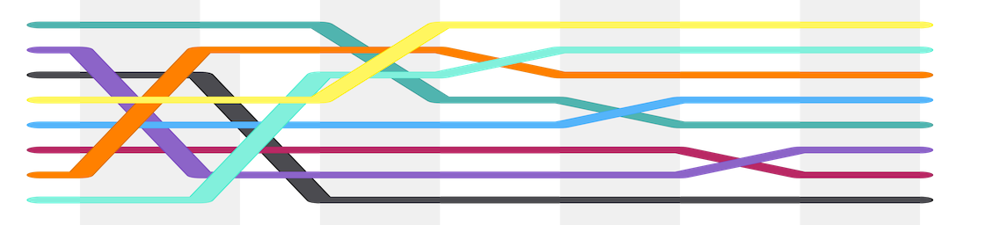

---
# You don't need to edit this file, it's empty on purpose.
# Edit theme's home layout instead if you wanna make some changes
# See: https://jekyllrb.com/docs/themes/#overriding-theme-defaults
layout: home
exclude: true
---
# Ethical Reflection Modules for CS 1
- [Evan M. Peck](http://www.eg.bucknell.edu/~emp017/), Associate Prof. of Computer Science, Bucknell University
- [email me](mailto:evan.peck@bucknell.edu) \| [find me on Twitter](https://twitter.com/evanmpeck) \| [visit my website](http://www.eg.bucknell.edu/~emp017/)

Image by [Balu Ertl](https://commons.wikimedia.org/w/index.php?curid=38531293)

| Activity Quick Link      | Programming Topic |
| ----------- | ----------- |
| [Developers as Decision-Makers](#decision-makers) |  Conditionals |
| [Developers as Gatekeepers](#gatekeepers)   | Functions & Data types |
| [Developers as Future Makers](#future-makers) | For Loops & Lists |
| [Developers as Image Manipulators](#manipulators) | Nested Loops & 2D Lists |
| [Developers as Prioritizers](#prioritizers) | OOP / APIs |

In Fall 2019, I redesigned our CS 1 course to integrate practice-based (coding!) reflection directly with technical concepts. This is a space to share those activities. Their goal is to:
1. Introduce **a deeper level of reflection in CS 1 courses**. I want students to see that their actions either directly or indirectly impact people, communities, and cultures, and that this impact is often not felt equally by different groups of people (along lines of gender, race, class, geography, etc.).
2. **Develop reflection habits _alongside_ coding habits** - all modules involve programming! I believe that habits are formed early in CS and must be tightly coupled with technical concepts in order for them to stick.
3. **Pair directly with _existing_ CS 1 curriculum** - CS 1 is already a busy course. You don't need to set aside a month of new material. I believe that reflection and responsible computing pairs directly with technical concepts already taught (conditionals, for loops, etc.)

What these activies are **not**:
- They are **not** a replacement for teaching students issues of [cultural competency](https://dl.acm.org/doi/abs/10.1145/3328778.3366792) and identity. While computer scientists can (and should) point to those issues in class, most of us are _not_ the experts. Students should be taking courses that directly speak to the structures of power that they will be introducing systems into (including gender / race / ethnicity / class / geography / etc.)
- They do **not** teach students what the _correct_ design is. They prompt students to reflect on the human consequences of their decisions. Sometimes, students answer _I'm not sure I can design this well enough to prevent harm_. That's a great answer too. Choosing _not_ to build something is okay.  

_Note: If you are looking for the old homepage of this site, [click this link](archive/old-index.html)_

------------

# Programming + Reflection Activities

## <a name="decision-makers">**[Conditionals]** Developers as Decision-Makers</a>

_What are the consequences when we turn people into numeric scores for algorithms? Who benefits and who are disadvantaged by our decisions?_

- **Scenario:** Develop a scoring algorithm to determine which classmates are prioritized for housing on campus. Students use a human-centered design process to reflect on the ways in which different scoring algorithms can advantage or harm different groups of people.
- **Practice:** Conditionals (`if/elif/else`), Input (`input()`), Difference in strings vs. ints
- **Material:** [Google Doc assn (2021)](https://docs.google.com/document/d/1t_ZvI0brEiHdb4CvvjA5X7-uUSU56p9h7alAf3RAcbg/edit?usp=sharing) \| [Nifty Assignments 2020 Page](http://nifty.stanford.edu/2020/peck-decision-makers/)
- **Author:** [Evan Peck (Bucknell University)](http://www.eg.bucknell.edu/~emp017/)
- **Context:** 2 hour lab setting. Small student groups.
- **Supplementary Reading:**
  - [New algorithms to score candidates for lifesaving organ donations](http://algorithmtips.org/2021/04/29/new-algorithms-to-score-candidates-for-lifesaving-organ-donations/)
  - [We created poverty. Algorithms won't make that go away (Virginia Eubanks)](https://www.theguardian.com/commentisfree/2018/may/13/we-created-poverty-algorithms-wont-make-that-go-away)
  - [What Happens When an Algorithm Cuts Your Health Care](https://www.theverge.com/2018/3/21/17144260/healthcare-medicaid-algorithm-arkansas-cerebral-palsy)

This assignment appeared as part of [_ACM SIGCSE'S Nifty Assignments_](https://dl.acm.org/doi/abs/10.1145/3328778.3372574) track. You can **cite that work with**:
> Nick Parlante, Julie Zelenski, John DeNero, Christopher Allsman, Tiffany Perumpail, Rahul Arya, Kavi Gupta, Catherine Cang, Paul Bitutsky, Ryan Moughan, David J. Malan, Brian Yu, Evan M. Peck, Carl Albing, Kevin Wayne, and Keith Schwarz. 2020. Nifty Assignments. In Proceedings of the 51st ACM Technical Symposium on Computer Science Education (SIGCSE '20). Association for Computing Machinery, New York, NY, USA, 1270–1271. DOI:https://doi.org/10.1145/3328778.3372574

--------------------

## <a name="gatekeepers">**[Functions & Data types]** Developers as Gatekeepers</a>

_What assumptions do we make about the people using our technology? What are the consequences of those assumptions? - who might we exclude? How do we capture diversity through design?_
- **Scenario:** Collect and validate personal information of people visiting a university. Through designing form input and validation, students uncover assumptions they have made about the diversity of different aspects of identity, including name, address, and gender.  
- **Practice:** data types, string and integer operations, python functions, conditionals (`if/elif/else`)
- **Material:** [Google Doc assn (2021)](https://drive.google.com/drive/folders/17Tb1lhn0AP5BUXT5gh80LhPDX7S8FsfX?usp=sharing) \| [old web-based assn (2019)](modules/input)
- **Author:** [Justin Li (Occidental College)](https://justinnhli.com/), Adaptation by [Evan Peck (Bucknell University)](http://www.eg.bucknell.edu/~emp017/)
- **Supplementary Reading:**
  - [Falsehoods Programmers Believe about Names](https://www.kalzumeus.com/2010/06/17/falsehoods-programmers-believe-about-names/)
  - [Falsehoods Programmers Believe about Addresses](https://www.mjt.me.uk/posts/falsehoods-programmers-believe-about-addresses/)
  - [Falsehoods Programmers Believe about Geography](https://wiesmann.codiferes.net/wordpress/?p=15187)
  - [Facebook suspends Native Americans over 'real name' policy](https://www.theguardian.com/technology/2015/feb/16/facebook-real-name-policy-suspends-native-americans)
  - [Airport body scan machines flag transgender passengers as threats](http://time.com/4044914/transgender-tsa-body-scan/)
  - ["Why are they all obsessed with gender?" - (Non)Binary Navigations Through Technological Infrastructures - by Katta Spiel](https://www.youtube.com/watch?v=ISTWLqChfkg)

--------------------

## <a name="future-makers">**[For Loops & Lists]** Developers as Future Makers</a>

_What does it mean to design a fair algorithm? What is the human cost of efficiency? What systemic advantages/disadvantages are your algorithms likely to amplify?_
- **Scenario:** Develop an algorithm that filters job applications based on student grades. Students reflect on specific cases in which a human would very likely make a different decision than the algorithm. What was the cost of automation?
- **Practice:** `for` loops, python `list` operations
- **Material:** [updated Google Doc assn (2021)](https://drive.google.com/drive/folders/1_mLvJBKvRLN0KoBW8uIKAhHvBEGn6M2t?usp=sharing) \| [old web-based assn (2019)](modules/hiring)
- **Author:** [Evan Peck (Bucknell University)](http://www.eg.bucknell.edu/~emp017/)
- **Writeup:** [Ethical Design in CS 1: Building Hiring Algorithms in 1 Hour (Evan Peck)](https://medium.com/bucknell-hci/ethical-design-in-cs-1-building-hiring-algorithms-in-1-hour-41d8c913859f)
- **Supplementary Reading:**
  - [Amazon scraps secret AI recruiting tool that showed bias against women](https://www.reuters.com/article/us-amazon-com-jobs-automation-insight/amazon-scraps-secret-ai-recruiting-tool-that-showed-bias-against-women-idUSKCN1MK08G)
  - [Fired by Bot at Amazon: 'It’s You Against the Machine'](https://www.bloomberg.com/news/features/2021-06-28/fired-by-bot-amazon-turns-to-machine-managers-and-workers-are-losing-out)
  - [Hiring Algorithms are Not Neutral (Gideon Manna and Cathy O'Neil)](https://hbr.org/2016/12/hiring-algorithms-are-not-neutral)
  - [Can an Algorithm Hire Better Than a Human?](https://www.nytimes.com/2015/06/26/upshot/can-an-algorithm-hire-better-than-a-human.html)
  - [Now Algorithms Are Deciding Whom to Hire, Based on Voice](https://www.npr.org/sections/alltechconsidered/2015/03/23/394827451/now-algorithms-are-deciding-whom-to-hire-based-on-voice)

This assignment appeared as part of [_ACM SIGCSE'S Assignments that Blend Ethics and Technology_](https://dl.acm.org/doi/abs/10.1145/3328778.3366994) special session. You can **cite that work with**:

> Stacy A. Doore, Casey Fiesler, Michael S. Kirkpatrick, Evan Peck, and Mehran Sahami. 2020. Assignments that Blend Ethics and Technology. In Proceedings of the 51st ACM Technical Symposium on Computer Science Education (SIGCSE '20). Association for Computing Machinery, New York, NY, USA, 475–476. DOI:https://doi.org/10.1145/3328778.3366994

--------------------

## <a name="manipulators">**[Nested Loops & 2D Lists]** Developers as Image Manipulators</a>

_How does representation in a dataset impact an algorithm's outcome? Is it possible to create a representation that treats all people fairly? What are the possible implications of facial recognition software when it is used on historically marginalized groups?_

- **Scenario:** This activity starts as a classic media manipulation lab (changing RGB values in pixels). In the last portion of the lab, students are given a series of face images, and write code to generate the _average_ face of those images. In the following lecture, students reflect on what happens when we analyze the demographics of the data underlying our face-averaging algorithm. We use it as an introductory analogy to the shortcomings of training data on machine-learning, and an entry to talk about face-recognition.
- **Practice:** 2D python `list`, nested `for` loops  
- **Material:** [Google Doc Assn (2021)](https://drive.google.com/drive/folders/19-2_YE2NiZQ7FvyOxKgKQ4PPHqkU1Imn?usp=sharing)
- **Author:** [Evan Peck (Bucknell University)](http://www.eg.bucknell.edu/~emp017/)
- **Supplementary Reading:** I use some the following material in a subsequent lecture where we reflect on the lab. [Click this link to get a sense of that material](https://twitter.com/evanmpeck/status/1307043732676644864)
  - [Gender Shades - by Joy Buolamwini](https://www.youtube.com/watch?v=rWMLcNaWfe0)
  - [ACM US Technology Policy Committee Urges Suspension of Private and Governmental Use of Facial Recognition Technologies](https://www.acm.org/binaries/content/assets/public-policy/ustpc-facial-recognition-tech-statement.pdf)
  - [Facial Recognition Is Accurate, if You’re a White Guy](https://www.nytimes.com/2018/02/09/technology/facial-recognition-race-artificial-intelligence.html)
  - [Teachable Machine](https://teachablemachine.withgoogle.com/train)
  - [An Ethics of Artificial Intelligence Curriculum for Middle School Students](https://docs.google.com/document/d/1e9wx9oBg7CR0s5O7YnYHVmX7H7pnITfoDxNdrSGkp60)
  - [Face Averager by Lisa DeBruine and Ben Jones](http://faceresearch.org/demos/average)

------------------------
## <a name="prioritizers">**[Intro OOP]** Developers as Prioritizers</a>

_What is 'moral' behavior in the context of a computer? How do we write code that is forced to assign value to people? What are the implications of our representation decisions?_
- **Scenario:** Program a disaster-relief robot to prioritize which distressed people to saves. This reframing of the Trolley Problem nudges students to reflect on issues of representation in their code (what are the problems with male/female representation? Should we even represent weight?), and consider how individual decisions could amplify systemic biases if it was used at scale.
- **Practice:** conditionals, use of APIs and objects, dictionaries (in optional last part)
- **Material:** [updated Google Doc assn (2021)](https://docs.google.com/document/d/1G3ghx_oBHVb0XYTEj7BnOnGxyIHsmdQXUIwPNHToKoE/edit?usp=sharing) \| [old website version (2019)](modules/ethicalengine2)
- **Author:** [Evan Peck (Bucknell University)](http://www.eg.bucknell.edu/~emp017/), parts of activity by [Vinesh Kannan (Mimir HQ)](https://github.com/vingkan)
- **Write ups:** _Note:_ these reflections are based on an earlier version of the assignment, but should still communicate the philosophy.
  - [The Ethical Engine: Integrating Ethical Design into Intro Computer Science (Evan Peck)](https://medium.com/bucknell-hci/ethical-design-in-cs-1-building-hiring-algorithms-in-1-hour-41d8c913859f)
  - [Write Up the Ethical Engine Lab (Justin Li)](https://howtostartacsdept.wordpress.com/2018/01/13/step-86-write-up-the-ethical-engine-lab/)
- **Supplementary Reading:**
  - [When binary code won’t accomodate non-binary people](https://slate.com/technology/2019/10/gender-binary-nonbinary-code-databases-values.html)
  - [Can you make AI fairer than a judge? Play our AI courtroom game](https://www.technologyreview.com/s/613508/ai-fairer-than-judge-criminal-risk-assessment-algorithm/)
  - [Machine Bias: there’s software used across the country to predict future criminals. And it’s biased against blacks.](https://www.propublica.org/article/machine-bias-risk-assessments-in-criminal-sentencing)
  - [Can an algorithm tell when kids are in danger?](https://www.nytimes.com/2018/01/02/magazine/can-an-algorithm-tell-when-kids-are-in-danger.html)

While not peer-reviewed, people have pointed to my reflection on Medium when looking to **cite this work**:
  > Evan Peck. 2017. The Ethical Engine: Integrating Ethical Design into Intro Computer Science. https://medium.com/bucknell-hci/the-ethical-engine-integratingethical-design-into-intro-to-computer-science-4f9874e756af

---------------------

## License
 This work is licensed under a <a rel="license" href="http://creativecommons.org/licenses/by-nc/4.0/">Creative Commons Attribution-NonCommercial 4.0 International License</a>
