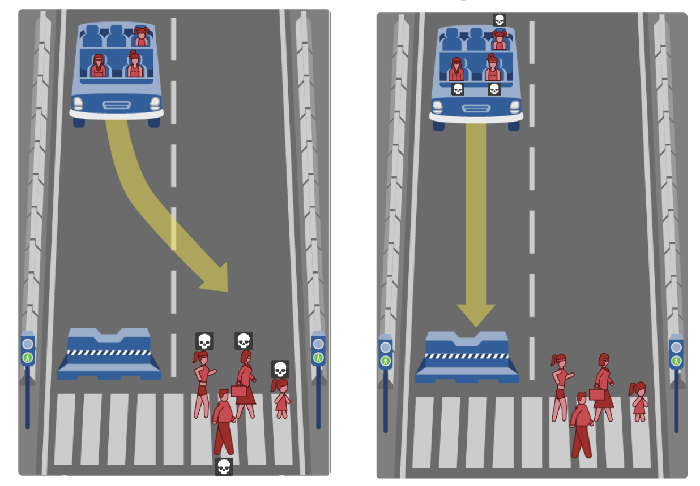

## Scenario: Teluta's Autonomous Cars
_Teluta_ - an autonomous vehicle company - has made extraordinary strides in self-driving cars and is ready to go to market. But there is a corner case that needs to be addressed. In the rare instances in which _Teluta_ vehicles can sense an impending crash, they need a mechanism to quickly assess and value human life. That is, the car must rapidly _choose who to save_.

While prioritizing _who to save_ will be decided by other employees of the company, your job is to decide which factors should be considered by their algorithms. To do this, you'll use object-oriented programming to create a template for _Teluta_ that models a person.

### Familiarize yourself with the Moral Machine
Visit MIT's [Moral Machine](http://moralmachine.mit.edu/). From their website:

> From self-driving cars on public roads to self-piloting reusable rockets landing on self-sailing ships, machine intelligence is supporting or entirely taking over ever more complex human activities at an ever increasing pace. The greater autonomy given machine intelligence in these roles can result in situations where they have to make autonomous choices involving human life and limb. This calls for not just a clearer understanding of how humans make such choices, but also a clearer understanding of how humans perceive machine intelligence making such choices.

Briefly, the _Moral Machine_ is an online simulator that lets you experiment with the kinds of scenarios that _Teluta_ outlined above.



Click the `Start Judging` buttons and make yourself go through a handful of scenarios. Consider the different characteristics of people and animals that are represented in the demonstration.

### Identifying Characteristics
On a sheet of paper (or in a file) write the following:
- A list of all the characteristics about entities (people or animals) that you think should be represented in your program.
- For each characteristic, identify the type of data that will be stored (`string`, `int`, `float`, `list`).
- For each characteristic, identify what the possible values might be for this attribute
  - For example, if you kept track of `years_old`, you might say that it is a positive integer from `0` to `100`.

Compare your list with a classmate. What similarities did you have? What differences? Record what drove those differences.

### From Visuals to Code

Now that you've run through the scenarios a few times, let's take a look at some code. We're going to practice object-oriented programming design and construct a `Person` class

(_NOTE: our `Person` can actually be an animal too. This representation is best done through inheritance relationships, but at this point, we've constructed this assignment to fit very early exposure to OOP. Feel free to modify to fit your own circumstances!_)

Your code will accomplish two different goals:  
1. It will articulate all your characteristics as attributes of the `Person` classmate
  - Example below: `self.charType` represents the 'character' type each entity - whether it is a person or an animal. You should include more characteristics.
  - For each attribute, give it a default parameter of `None` in the constructor (`__init__`).
2. It will allow for the creation of a randomly generated `Person`.
  - Once completed, typing `person = Person()` should generate an entity with random attributes.
  - Currently, our `CHAR_TYPES` variable contains not only the possible values for `self.charType`, but also lists them in the same probability with which they appear. For example, `CHAR_TYPES` contains `human` 6 times and `cat` and `dog` 1 time each. That means that `human` is 3x more likely to appear if someone uses this code to generate a random person. This also forces you to externalize the possible values you generated earlier and represent them directly in your code.

```python
class Person:

  CHAR_TYPES = ["human", "human", "human", "human", "human", "human", "dog", "cat"]

  # Constructor - you'll need to add more parameters than this
  def __init__(self, charType=None):
    self.charType = charType
    if charType is None:
      self.charType = random.choice(self.CHAR_TYPES)
```

Once you feel comfortable with your code, feel free to move onto part 2.
