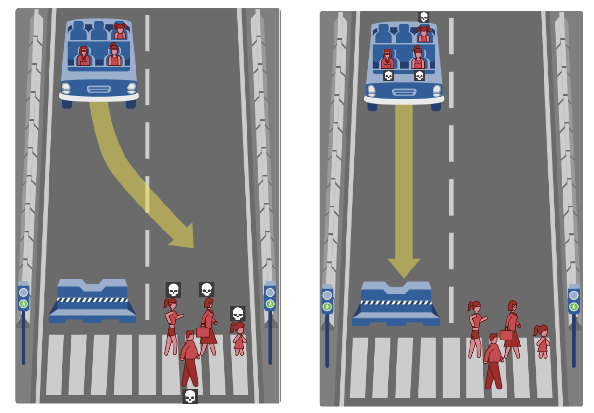

## Scenario: Disaster Relief Robot

You are working for an emerging robotics company, _Robotoni_, that is taking the admiral stance of developing robots to aid in life-threatening events. Their current objective is to build a fleet of autonomous robots that will rescue people in who are caught in two natural disasters: wildfires and floods.

_Robotoni_ has already built a robot that can navigate unknown terrain and successfully rescue people who are in need of help. However, for _Robotoni_ robots to act autonomously and maximize their impact, they must also make hard decisions. In effect, the _Robotoni_ robot must **prioritize who to save**.

Your job is to write a comparison algorithm for the _Robotoni Disaster-Relief Robot_ in which it compares two groups of people and decides which group to prioritize for relief.


### Explore the Moral Machine
While not situated in the context of disaster-relief robots, similar questions have been asked in the context of autonomous vehicles. To explore this context, visit MIT's [Moral Machine](http://moralmachine.mit.edu/). From their website:

> From self-driving cars on public roads to self-piloting reusable rockets landing on self-sailing ships, machine intelligence is supporting or entirely taking over ever more complex human activities at an ever increasing pace. The greater autonomy given machine intelligence in these roles can result in situations where they have to make autonomous choices involving human life and limb. This calls for not just a clearer understanding of how humans make such choices, but also a clearer understanding of how humans perceive machine intelligence making such choices.

Briefly, the _Moral Machine_ is an online simulator that lets you experiment with the kinds of scenarios that _Teluta_ outlined above.



Click the `Start Judging` buttons and make yourself go through a handful of scenarios. Try to reflect on exactly how you're making your decisions.

### From Values to Code

Instead of deciding between people in a car vs. pedestrians in a crosswalk, your algorithm must decide between two groups of people at different locations who are stranded and need to be rescued (for example, two different locations in the city during a flash-flood).

_Who will your algorithm prioritize?_

We've created python code that replicates the random scenarios that are generated in the _Moral Machine_. The entities you must save may be people or animals. The people may be of various ages, genders, and professions. To access all of this information and program the _Robotoni Disaster-Relief Robot_, you'll use the _Ethical Engine API_, which allows you to analyze details about scenarios using python code:

- [Ethical Engine API](code/docs.html)

You are given access to a few python files which you will use to various degrees:
- [`scenario.py`](code/scenario.py) contains our code that automatically generates random scenarios that your robot must navigate. You do _not_ need to alter this code. However, it is worth reading through and seeing if you understand it.
- [`engine.py`](code/engine.py) contains the code that you'll write that _decides_ which people to prioritize and save. This is where you'll do most of your work.
- [`main.py`](code/main.py) is the code you'll run that puts all the pieces together. You'll need to comment or uncomment a line or two here to switch between your various decision implementations.
  - To run this file, simply type `python3 main.py` in the command line.


### Coding Predefined Priorities
Below are written descriptions of rulesets for sample decision algorithms. Your job is to write and test three different decision methods in `engine.py` that precisely implement each ruleset:

- `ruleset1`: Save the person in location 2, if and only if they are pregnant.
- `ruleset2` Save the person in location 1, if they are **not** trespassing or if they are a child.
- `ruleset3` The first priority is to save the person who is a baby. The second priority is to save athletic people. The third priority is to save people who are either a doctor or a CEO. The fourth priority is to save females. The fifth priority is to save the person in location 1.

Fill in the appropriate methods in `engine.py`. When you want to test one of the decision methods, edit line `23` of `main.py` to choose the target method. Then execute the following command in your terminal to run the program:

_Helpful Tip:_ Scenarios are generated randomly. You can also generate pseudo-random scenarios, where the _same_ scenarios are run each time the program runs. Specify a seed for the random generator as a runtime argument like so:

```bash
$ python3 main.py 12
```

### From Gut Feelings to Code: Individuals

Now that you have experience using the [Ethical Engine API](code/docs.html), design your own decision algorithm in `my_decision` that decides between one person in each location! You can refer to your notes from the Moral Machine scenarios or come up with an entirely new method of deciding.

Before writing your code, write a description of how you want the decision to be made.

### Reflection Questions
- Are there any discrepancies between your written description and the python algorithm?
- Why do you think that your algorithm is the _right_ one? What are the tradeoffs?
- Is it possible that your algorithm could amplify systemic biases if it was used at scale?

## From Gut Feelings to Code: Groups
While you may be able to accomplish the previous sections with a set of complex conditional statements, the problem gets a lot more complicated when you need to choose between _groups_ of people.

First, let's change the code in `scenario.py` so that it will create scenarios fo groups instead of individuals. Find the following code:

```python
# The minimum/maximum number of people at each location
MIN_LOCATION1 = 1
MAX_LOCATION1 = 1
MIN_LOCATION2 = 1
MAX_LOCATION2 = 1
```
Change `MAX_LOCATION1` to be equal to `4` and `MAX_LOCATION2` to be equal to `4`. Next, find the constructor for the `Scenario` class:

```python
def __init__(self, loc1people=None, loc2people=None, youInLoc1=None,
              trespassing=None, sameNum=True):
```

Change `sameNum` so that it is `sameNum=False`. This will change the random generation of scenarios so that each group _may not be the same size_. Think carefully about how you can handle these situations. How can you possibly compare groups of people?

One possible method is to come up with a _point system_ to value people. That is, assign each person with a point value based on their characteristics, and then save the group that is valued with the most amount of points.

### More Reflection
- How does the switch from conditionals to a point system change how you feel about this program? Why?
- Suppose your algorithm was repurposed for military operations - do you still feel as confident in your approach?
- In this activity, we forced you to use a set of characteristics that were already defined for you. But suppose that you could create your own... what would or wouldn't you include?
